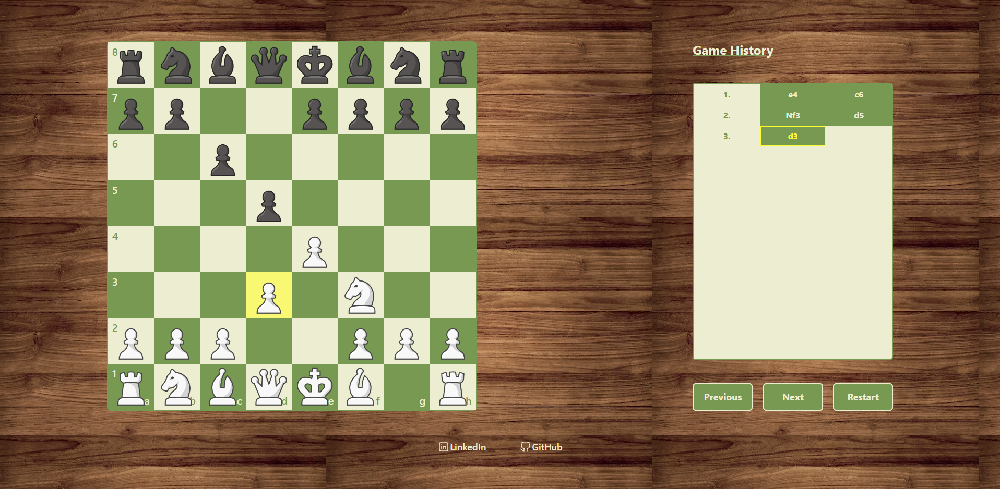

<h1 align="center">Chess Game</h1>

<div align="center">
   por  <a href="https://github.com/AitorMelero" target="_blank">Aitor Melero</a>.
</div>
</br>
<div align="center">

[](https://es.react.dev/)
[](https://www.typescriptlang.org/)
[](https://vitejs.dev/)
[](https://tailwindcss.com/)

---

</div>

<!-- INDICE -->

## Índice

-   [Objetivo](#objetivo)
-   [Tecnologías](#tecnologías)
-   [Instalación y ejecución](#instalación-y-ejecución)
-   [Jugar](#jugar)
-   [Contacto](#contacto)

<!-- OBJETIVO -->

## Objetivo

El objetivo de este proyecto es el desarrollo de una web donde dos personas pudieran jugar una partida de ajedrez en un mismo ordenador, en local.

Con respecto a la web, la motivación principal es ganar experiencia con diferentes tecnologías como [React](https://es.react.dev/), [TypeScript](https://www.typescriptlang.org/) o [Tailwind](https://tailwindcss.com/).

## Tecnologías

[](https://developer.mozilla.org/es/docs/Web/HTML)
[](https://developer.mozilla.org/es/docs/Web/CSS)
[](https://www.typescriptlang.org/)
[](https://developer.mozilla.org/es/docs/Web/JavaScript)
[](https://es.react.dev/)
[](https://tailwindcss.com/)

<!-- INSTALACION Y EJECUCION -->

## Instalación y ejecución

### Instalar dependencias:

```bash
npm install
```

### Ejecutar la web en modo desarrollador:

```bash
npm run dev
```

### Ejecutar la web en modo desarrollador en una red local:

```bash
npm run dev -- --host
or
npm run host
```

### Creación de ejecutable

```bash
npm run build
```

## Jugar

El aspecto de la web es el siguiente:



Para jugar, se necesitarán dos jugadores haciendo uso de un mismo ordenador. Las partidas siguen las reglas básicas del [ajedrez](https://www.chess.com/es/como-jugar-ajedrez). Las partidas terminan una vez se hace jaque mate.

Durante la partida se puede navegar por el historial de la misma, bien hacia atrás (pulsando el botón de _Previous_) o hacia delante (pulsando el botón de _Next_) de jugada en jugada o dirigiéndose a una jugada en concreto pulsando en el botón del historial correspondiente a dicha jugada. Además se podrá reiniciar la partida pulsando en el botón de _restart_.

## Contacto

### Aitor

[](https://github.com/AitorMelero)
[](https://www.linkedin.com/in/aitor-melero-pic%C3%B3n-678105293/)
